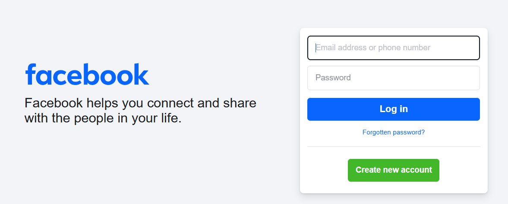

# HTML Project One Checkpoint

## Instructions

- 1.Create the navbar: home, about, work, resume, contact ✅
- 2.Create the “about” section, ”work” section, ”resume” section, and ”contact” section (using HTML Forms) ✅
- 3.Create the page footer. ✅

## Other Requirements

- use semantic tags. ✅
- add a video/audio to the web page. ✅
- use local links, lists, or tables. ✅
- use HTML forms ✅

### Code snippets

```bash
<!-- Initialize HTML  -->
<!DOCTYPE html>
<html lang="en">

<head>
    <meta charset="UTF-8">
    <meta name="viewport" content="width=device-width, initial-scale=1.0">
    <!-- Name of the Project -->
    <title>Portfolio</title>
</head>

<body>
    <!-- Navbar Section -->
    <nav style="background-color: cyan;">
        <ul style="display: flex; flex-direction: row; gap: 3rem;">
            <li><a href="#">Home</a></li>
            <li><a href="#about">About</a></li>
            <li><a href="#work">Work</a></li>
            <li><a href="#resume">Resume</a></li>
            <li><a href="#contact">Contact</a></li>
        </ul>
    </nav>

    <main>
        <!-- About Section -->
        <a name="about">
            <h1 style="color: blue; border-bottom: 1px solid black;">
                <strong>About Me</strong>
            </h1>
            <p>Hi, I'm Enoch Garoli. I'm a web developer with a passion for creating beautiful websites.
                <br>
                My goal is to create clean, modern and responsive websites that will help you stand out from the crowd.
            </p>

            <!-- Youtube Video -->
            <iframe width="560" height="315" src="https://www.youtube.com/embed/9bZkp7q19f0" frameborder="0"
                allow="accelerometer; autoplay; encrypted-media; gyroscope; picture-in-picture" allowfullscreen>
            </iframe>

        </a>

        <!-- Work Section -->
        <a name="work">
            <h1 style="color: blue; border-bottom: 1px solid black;">
                <strong>My Work</strong>
            </h1>

            <div>
                <h2 style="text-decoration: underline;">Project 1</h2>
                <p>Project 1 Description</p>
                
            </div>

            <div>
                <h2 style="text-decoration: underline;">Project 2</h2>
                <p>Project 2 Description</p>
                
            </div>

        </a>

        <!-- Resume Section -->
        <a name="resume">
            <h1 style="color: blue; border-bottom: 1px solid black;">
                <strong>My Resume</strong>
            </h1>
            <!-- A table to show various resume info -->
            <table style="border: 1px solid black;">
                <tr>
                    <th style="border: 1px solid black;">Education</th>
                    <td style="border: 1px solid black;">Bachelor's Degree in Computer Science</td>
                </tr>
                <tr>
                    <th style="border: 1px solid black;">Experience</th>
                    <td style="border: 1px solid black;">2 years of web development experience</td>
                </tr>
                <tr>
                    <th style="border: 1px solid black;">Skills</th>
                    <td style="border: 1px solid black;">
                        <ul>
                            <li>HTML</li>
                            <li>CSS</li>
                            <li>JavaScript</li>
                            <li>PHP</li>
                        </ul>
                    </td>
                </tr>
            </table>
        </a>

        <!-- Contact Section {To use HTML Forms on this Bit} -->
        <a name="contact">
            <h1 style="color: blue; border-bottom: 1px solid black;">
                <strong>Contact Me</strong>
            </h1>
            <p>Feel free to contact me at </p>
            <form action="#" method="post">
                <label for="name">Name:</label>
                <input type="text" id="name" name="name" required>
                <br>

                <label for="email">Email:</label>
                <input type="email" id="email" name="email" required>
                <br>

                <label for="message">Message:</label>
                <textarea id="message" name="message" required></textarea>
                <br>

                <button type="submit">Send</button>
            </form>
        </a>
    </main>

    <footer style="background-color: aqua;">
        <p>&copy; 2020 Enoch Garoli</p>
    </footer>
</body>

</html>
```